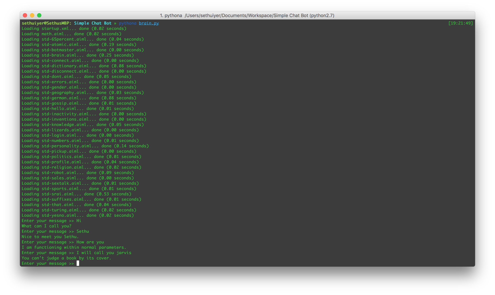

# Simple Chat Bot

A Simple Chatbot Application using Python and AIML (Artificial Intelligence Markup Language).

#Output

#Things to do
1. Direct the output to `say` command to deliver the result as speech.
2. Include more AIML files.
